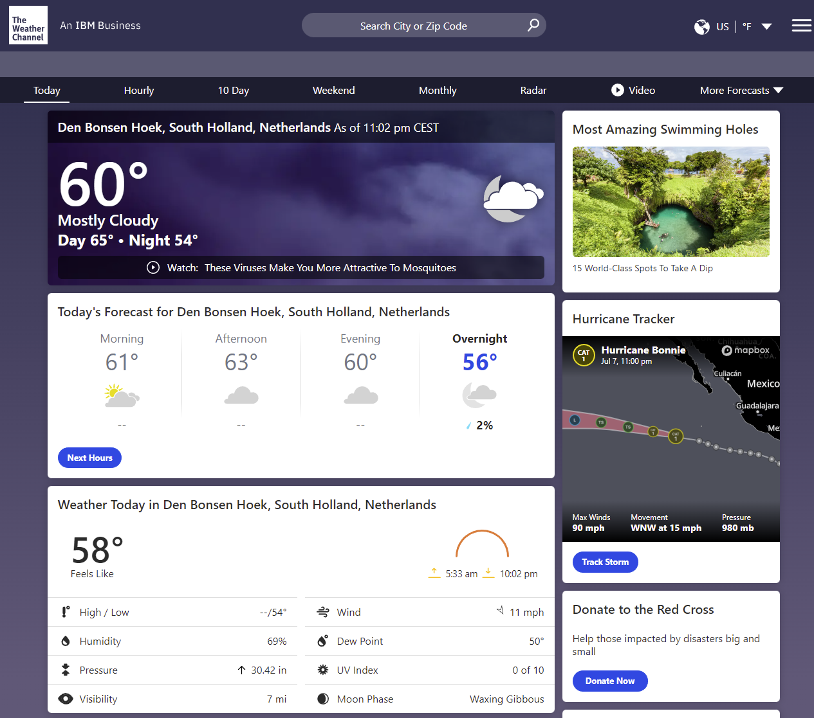
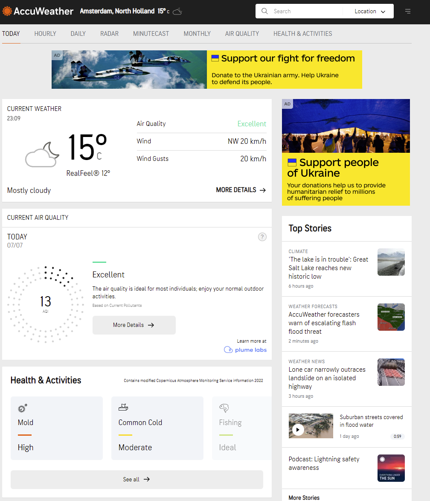
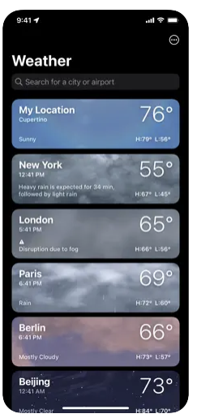

# ZonneZoeker

Author: Marijn van Dorp

Created:
25 Maart, 2022

# Table of contents
1. [Inleiding](#1-inleiding)
2. [Probleem stelling](#2-probleemstelling)
3. [Eisen webapplicatie](#3-eisen-webapplicatie)
    1. [Functioneel](#31-functioneel)
    2. [Niet-functioneel](#32-niet-functioneel)
4. [Use cases](#4-use-cases)
5. [Ontwerp](#5-ontwerp)
    1. [Inspiratie](#51-inspiratie)
    2. [Wireframes](#52-wireframes)
    3. [Schermontwerp](#53-schermontwerp)
    4. [Figma](#54-figma)
6. [Verantwoording](#6-verantwoording-zonnezoeker)
    1. [Technische afwegingen](#61-technische-keuzes--ontwerpbeslissingen)
       1. [App opzet](#611-app-opzet)
       2. [Layout](#612-layout)
       3. [Gebruikers validatie](#613-gebruikers-validatie)
       4. [Helper Functies](#614-helper-functies)
       5. [React Hook Form](#615-react-hook-form)
       6. [Decoderen JWT-token](#616-decoderen-van-de-jwt-token)
       7. [React-Router-Dom](#617-react-router-dom-52)
       8. [Environment Variables](#618-environment-variables)
       9. [Design first, code later](#619-design-first-code-later)
       10. [User input](#6110-user-input-gelimiteerd-houden)
    2. [Huidige beperkingen](#62-huidige-beperkingen)      
    3. [Uitbreidingsmogelijkheden](#63-uitbreidingsmogelijkheden)
    4. [Reflectie](#64-reflectie)       
       
## 1. Inleiding
Weer apps... er zijn er een hoop, maar deze is van mij en ik ben er erg trots op!\
En hoewel de code wellicht nog niet optimaal is en sommige ontwerpkeuzes twijfelachtig, heb ik enorm veel plezier gehad in het verzinnen en creëren van dit project.\
Graag neem ik de lezer van dit document mee op wat voor mij een hele leerzame periode is geweest, waarin ik niet alleen een hoop over front end heb geleerd, maar de opleiding ook het startpunt en inspiratie was voor een geheel nieuwe carrière richting.\
Ik hoop dat mijn enthousiasme en motivatie duidelijk wordt tijdens het doorlopen van mijn documentatie en van mijn ZonneZoeker.\ 
Zonder verder onderbrekingen presenteer ik ZonneZoeker (v1.0), een project waar ik nog veel meer versie van zou willen maken.

ZonneZoeker is React Weer applicatie die de gebruiker in 1 enkele oogopslag alle relevante weer-data overzichtelijk laat zien en ook door een gepatenteerd rating systeem* verteld hoe deze weergegevens geïnterpreteerd dienen te worden in een cijfer van 1-10 voor uiteenlopende activiteiten.
Waait het hard? Dan wordt het een laag cijfer voor fietsen, maar het is weer goed voor windsurfen. Droog en een zonnetje met een lekkere temperatuur? Klinkt als een goed cijfer voor het strand!

## 2. Probleemstelling
Je kan nu niet in éen oogopslag zien wat de weergegevens zijn per stad in Nederland en hoe je deze gegevens dient te interpreteren? Kan ik wel lekker fietsen als het 5m/s waait? who knows? Nou..ZonneZoeker weet het!!\
Mijn app brengt in laat alle relevante weergegevens zien, en geeft op eigen wijze een wiskunde interpratie* aan deze gegevens\
De app maakt gebruik van de OpenWeather API waardoor de gebruikers via de zoekfunctie snel kunnen zien wat de weergegevens zijn voor hun geselecteerde stad

*(Nog)Niet echt....

## 3. Eisen Webapplicatie
Om dit allemaal te kunnen doen, is ZonneZoeker onderverdeeld in de volgende functionele en niet-functionele eisen;

### 3.1 Functioneel
| No. | Omschrijving                                                                                        |
|-----|-----------------------------------------------------------------------------------------------------|
| 1   | Als niet geregistreerde gebruiker kan je alleen een simpele zoekopdracht doen                       |
| 2   | Als niet geregistreerde gebruiker kan je een gebruikers account aanmaken                            |
| 3   | Als gebruiker zie je meer gedetailleerde data                                                       |
| 4   | Als gebruiker kan je een profiel foto toevoegen                                                     |
| 5   | De applicatie stuurt de gebruiker een welkomst email bij registratie                                |
| 6   | De applicatie laat met icoontjes ook visueel het weertype zien (Bewolkt, zonnig, rtc)               |
| 7   | De applicatie interpreteert de weerdata en geeft hiervoor een cijfer terug                          |
| 8   | De gebruiker kan zoeken op plaats.                                                                  |
| 9   | De applicatie vraagt de gebruiker om een gebruikersnaam/wachtwoord om in te loggen                  |
| 10  | De applicatie laat de luchtkwaliteit zien                                                           |
| 11  | De applicatie laat bijzondere situaties zien (Zware storm, Extreem weer)                            |
| 12  | De applicatie laat de temperatuur zien                                                              |
| 13  | De applicatie laat de gevoelstemperatuur zien                                                       |
| 14  | De applicatie laat de windsnelheid zien                                                             |
| 15  | De applicatie laat de luchtvochtigheid zien                                                         |
| 16  | De applicatie laat de tijd van zon opkomst en zonsondergang zien                                    |
| 17  | De applicatie laat de gevoelstemperatuur zien                                                       |
| 18  | De applicatie laat de locatie zien                                                                  |
| 19  | De gebruiker kan contact opnemen met de beheerder van de applicatie                                 |
| 20  | De applicatie laat de weergegevens zien van de komende dagen                                        |
| 21  | De gebruiker kan zijn wachtwoord wijzigen in het persoonlijk profiel                                |
| 22  | De gebruiker kan zijn gebruikers naam wijzigen in het persoonlijk profiel                           |
| 23  | De applicatie geeft een melding weer op het scherm wanneer een gebruiker verkeerde gegevens opgeeft |
| 24  | De applicatie geeft een melding weer op het scherm wanneer een gebruiker correcte gegevens opgeeft  |                                                                                                          |
| 25  | De applicatie stuurt pas de gegevens naar de server als de formulieren gevalideerd zijn             |
| 26  | De applicatie stuurt toont bij de formulieren foutieve velden en wat hierin verbeterd moet worden   |
| 27  | De applicatie geeft de windrichting ook visueel aan met een werkend 'kompas'                        |

### 3.2 Niet-Functioneel

| No. | Omschrijving                                                                                                           |
|-----|------------------------------------------------------------------------------------------------------------------------|
| 1   | De pagina moet binnen 5 seconden geladen zijn                                                                          |
| 2   | De zoekopdracht moet een resultaat terug geven binnen 2 seconden                                                       |
| 3   | De interface moet responsive zijn                                                                                      |
| 4   | De Interface moet goed en duidelijk leesbaar zijn                                                                      |
| 5   | De applicatie moet leesbaar zijn voor mensen met kleurenblindheid                                                      |
| 6   | De applicatie moet met semantic HTML geschikt zijn voor screenreaders                                                  |
| 7   | De authenticatie token van de gebruiker is maar beperkt geldig, wordt uitgelogd indien token expire is                 |
| 8   | De app is op te schalen                                                                                                |
| 9   | De applicatie moet makkelijk te onderhouden zijn                                                                       |
| 10  | Standaard gebruikt de site de Nederlandse taal                                                                         |
| 11  | De gebruiker kan kiezen uit de eenheden voor temperatuur                                                               |
| 12  | Standaard staat de eenheid voor temperatuur op Celsius, zoals het hoort                                                |
| 13  | De gebruiker kan binnen 1 klik bij alle belangrijke functionaliteiten                                                  |
| 14  | Het systeem laat een melding zien als er geen resultaten van de zoekopdracht zijn                                      |
| 15  | De interface is modulair uitbreidbaar                                                                                  |
| 16  | De huisstijl wordt overal doorgevoerd                                                                                  |
| 17  | Het Wachtwoord moet elke 90 dagen worden vervangen                                                                     |
| 18  | De applicatie heeft een 99.5% up-time                                                                                  |
| 19  | Alle velden in een formulier zijn verplicht                                                                            |
| 20  | Wachtwoord moet minimaal 6 karakters lang zijn                                                                         |
| 21  | De app zal voorzien zijn van een duidelijke Readme                                                                     |
| 22  | De applicatie moet op alle moderne browsers werken                                                                     |
| 23  | Gebruikers kunnen geen account aanmaken als het email adres of de gebruikersnaam als in gebruik zijn                   |
| 24  | Wanneer een gebruiker is ingelogd dan krijgt de gebruiker zijn eigen accountgegevens te zien en niet die van een ander |
| 25  | De gebruiker kan in 1 oogopslag alle gegevens zien per zoekresultaat                                                   |

## 4. Use cases
De kernfunctionaliteiten van ZonneZoeker kunnen worden verdeeld in de volgende 4 UseCases;

| Use Case 1               | De gebruiker maakt een gebruikers account aan                                                                                                                                                                                                                                             |
|--------------------------|-------------------------------------------------------------------------------------------------------------------------------------------------------------------------------------------------------------------------------------------------------------------------------------------|
| **Actor**                | gebruiker                                                                                                                                                                                                                                                                                 |
| **Preconditie 1**        | De gebruiker heeft een geldig email adres                                                                                                                                                                                                                                                 |
| **Preconditie 2**        | De gebruiker heeft een werkende internet verbinding en ernstige behoefte aan alle functionaliteiten                                                                                                                                                                                       |
| **Trigger**              | De gebruiker klikt op de "Registreren" link, in de inloggen pagina                                                                                                                                                                                                                        |
| **Main succes scenario** | 1. De gebruiker drukt op de "Registeren" knop 2. De gebruiker voert de benodigde gegevens in 3. De gebruiker drukt op de knop "registratie voltooien" 4. Systeem laat melding zien dat de registratie succesvol is verlopen 5. De gebruiker kan nu inloggen als gebruiker |
| **Postconditie**         | De gebruiker heeft een gebruikersaccount                                                                                                                                                                                                                                                  |

 

| Use Case 1  Scenario 1 a | De knop "Registratie voltooien" is niet aan te klikken                                                                                                                                    |
|------------------------------|-------------------------------------------------------------------------------------------------------------------------------------------------------------------------------------------|
| **Alternative scenario**     | 1. Het Systeem geeft per invoerveld feedback op niet correctie validatie" 2. De gebruiker corrigeerd de gebruik gegevens 3. De gebruiker drukt op de knop "registratie voltooien" |
| **Postconditie**             | De gebruiker vervolgt main succes scenario bij stap 4                                                                                                                                     |

 

| Use Case 1  Scenario 5 a | De gebruiker kan niet inloggen                                                                                                                                                                          |
|------------------------------|---------------------------------------------------------------------------------------------------------------------------------------------------------------------------------------------------------|
| **Alternative scenario**     | 1. Het Systeem geeft aan "Ongeldige gegevens" 2. De gebruiker controleerd of de account gegevens correct zijn 3. De gebruiker kan de gebruikers gegevens resetten doormiddel van een link"  |
| **Postconditie**             | De gebruiker vervolgt main succes scenario bij stap 4                                                                                                                                                   |

 

| Use Case 2               | De gebruiker voert de zoekopdracht uit                                                                                                                                                                                                                                                                     |
|--------------------------|------------------------------------------------------------------------------------------------------------------------------------------------------------------------------------------------------------------------------------------------------------------------------------------------------------|
| **Actor**                | (Geregistreerde) Gebruiker                                                                                                                                                                                                                                                                                 |
| **Preconditie 1**        | De geregistreerde gebruiker moet zijn ingelogged                                                                                                                                                                                                                                                           |
| **Preconditie 2**        | De (geregistreerde) gebruiker heeft zijn zoekopdracht ingevuld                                                                                                                                                                                                                                             |
| **Trigger**              | De (geregistreerde) gebruiker drukt op de "Zoek" knop                                                                                                                                                                                                                                                      |
| **Main succes scenario** | 1. De (geregistreerde) gebruiker drukt op de "Zoek" knop  2. De applicatie returned de weergegevens van de ingevoerde term 3. De gebruiker scrolled door de terug gegeven data 4. Systeem laat melding zien dat de zoekopdracht succesvol was                                              |
| **Postconditie**         | De (geregistreerde)gebruiker ziet de resultaten waar hij de rechten op heeft                                                                                                                                                                                                                               |

 

| Use Case 2  Scenario 1 a | De knop "Zoek" van de zoekbalk geeft een foutmelding                                                                                                        |
|------------------------------|-------------------------------------------------------------------------------------------------------------------------------------------------------------|
| **Alternative scenario**     | 1. Het Systeem geeft aan "Huidige plaatsnaam niet gevonden!" 2. De gebruiker corrigeerd de gebruik gegevens 3. De gebruiker drukt op de knop "Zoek" |
| **Postconditie**             | De gebruiker vervolgt main succes scenario bij stap 2                                                                                                       |

 

| Use Case 3               | Alleen de geregistreerde gebruiker kan Activiteit Ratings (Fietsen, BBQ'en, etc) zien, gebaseerd op de gekozen plaatsnaam en weer variabelen                                       |
|--------------------------|------------------------------------------------------------------------------------------------------------------------------------------------------------------------------------|
| **Actor**                | Geregistreerde Gebruiker                                                                                                                                                           |
| **Preconditie 1**        | De geregistreerde gebruiker moet zijn ingelogd                                                                                                                                     |
| **Preconditie 2**        | De geregistreerde gebruiker moet zijn zoekopdracht hebben gedaan                                                                                                                   |
| **Trigger**              | De geregistreerde gebruiker drukt op de "Ratings" knop                                                                                                                             |
| **Main succes scenario** | 1. De geregistreerd gebruiker drukt op de "Ratings" knop  2. De applicatie toont de ratings van alle activiteiten 3. De gebruiker scrolled door de terug gegeven data  |
| **Postconditie**         | De geregistreerde gebruiker ziet de resultaten waar hij de rechten op heeft                                                                                                        |

 

| Use Case 3  Scenario 1 a | De knop "Zoek" van de zoekbalk geeft een foutmelding                                                                                                          |
|------------------------------|---------------------------------------------------------------------------------------------------------------------------------------------------------------|
| **Alternative scenario**     | 1. Het Systeem geeft aan "Huidige plaatsnaam niet gevonden!" 2. de gebruikers corrigeerd de gekozen zoekterm  3. De gebruiker drukt op de knop "Zoek" |
| **Postconditie**             | De gebruiker vervolgt main succes scenario bij stap 2                                                                                                         |

 

| Use Case 4               | Alleen de geregistreerde gebruiker kan voorspellingen voor de komende 48 uur zien, gebaseerd op de gekozen plaatsnaam                                                                          |
|--------------------------|------------------------------------------------------------------------------------------------------------------------------------------------------------------------------------------------|
| **Actor**                | Geregistreerde Gebruiker                                                                                                                                                                       |
| **Preconditie 1**        | De geregistreerde gebruiker moet zijn ingelogd                                                                                                                                                 |
| **Preconditie 2**        | De geregistreerde gebruiker moet zijn zoekopdracht hebben gedaan                                                                                                                               |
| **Trigger**              | De geregistreerde gebruiker drukt op de "Voorspelling" knop                                                                                                                                    |
| **Main succes scenario** | 1. De geregistreerd gebruiker drukt op de "Voorspelling" knop  2. De applicatie toont de voorspellingen van alle activiteiten 3. De gebruiker scrolled door de terug gegeven data  |
| **Postconditie**         | De geregistreerde gebruiker ziet de resultaten waar hij de rechten op heeft                                                                                                                    |

 

| Use Case 4  Scenario 1 a | De knop "Zoek" van de zoekbalk geeft een foutmelding                                                                                                          |
|------------------------------|---------------------------------------------------------------------------------------------------------------------------------------------------------------|
| **Alternative scenario**     | 1. Het Systeem geeft aan "Huidige plaatsnaam niet gevonden!" 2. de gebruikers corrigeerd de gekozen zoekterm  3. De gebruiker drukt op de knop "Zoek" |
| **Postconditie**             | De gebruiker vervolgt main succes scenario bij stap 2                                                                                                         |
|                              |                                                                                                                                                               |

 

## 5. Ontwerp  
In dit hoofdstuk een overzicht van hoe het ontwerp van mijn app tot stand is gekomen.
Van wireframes op papier tot uiteindelijk digitaal ontwerp in figma

### 5.1 Inspiratie 
Het hoofdontwerp is inspired op de volgende pagina;
https://www.weather.com/

Het gebruik van losse tiles, het kleurgebruik en het duidelijk weergaven van alle informatie in één enkele oogopslag was precies wat ik zocht in een app.
Ik heb deze geprobeerd terug te laten komen in mijn eigen ontwerp

Mijn 2e inspiratie bron is;
https://www.accuweather.com/

Het simpele kleurgebruik en de indeling van de tiles sprak me heel erg aan.
Hun logo gebruik met een naam er direct achter en in nadruk op de zoekbalk heb ik ook in mijn app geprobeerd terug te laten komen

Mijn 3e inspiratie bron is:
https://apps.apple.com/us/app/weather/id1069513131

Ik was inspiratie op aan het doen op mijn mobiel toen ik mijn ingebouwde weatherapp zag.
Dit bevestigde voor bij de op tiles gebaseerd ontwerp en ziet er niet alleen op een groot scherm duidelijk ook maar ook op mobiel
De nadruk op de temperatuur en de simpelheid van 1 zoekbalk en 1 soort tiles heb ik ook terug laten komen in mijn app.

### 5.2 Wireframes 
Bevat de gescande op gefotografeerde wireframes, geschetst op papier, van tenminste 5 pagina's\
deze dienen goed leesbaar te zijn, inclusief begeleidende tekst waarin duidelijk wordt over welke pagina het gaat

### 5.3 Schermontwerp 
Bevat screenshots van de schermontwerpen met titels en beschrijvingen.

### 5.4 Figma 
Aan de hand van alle design informatie ja je schermontwerpen maken in figma/adobe\
Deze bevatten zodanig veel uitgewerkte details dat je tijdens het programmeren geen ontwerpbeslissingen meer hoeft te maken

Opleveren; Het functionele ontwerp (dit document) en een link naar het openbare figma project.

## 6. Verantwoording ZonneZoeker

### 6.1 Technische keuzes & ontwerpbeslissingen.

Hier wil ik graag even sommige keuzes en redeneringen toelichten die zijn genomen tijdens de ontwikkeling van ZonneZoeker.

### 6.1.1 App opzet

Ik heb ervoor gekozen hele duidelijk lagen in mijn applicatie aan te brengen;
Bovenste laag; App.js- Op deze laag creëer ik het hart van de applicatie; De data arrays worden hier gecreëerd, de routings/rechten worden hier verdeeld, ik geef de data door aan de pagina's die dit nodig hebben en ik render het stuk van de pagina die alle pagina's in het gemeen hebben; de header
Middelste laag; De pagina's- Vanuit app.js krijgen de pagina's hun ruwe data die ik over de pagina's verdeel. Dit is ook waar ik de data correct formatteer door middel van helper functies zodat het laagste nivo alleen maar het correct weergeven van deze data is
Onderste laag; de componenten, of in mijn geval de tiles, van het dashboard. Deze krijgen van de pagina erboven de correct geformatteerde data aangeleverd zodat ik me in de componenten alleen druk hoef te maken over de plaatsing en styling.

Deze opzet is door vallen en opstaan tot staand gekomen omdat naarmate het project groeide ik het overzicht verloor en ik me genoodzaakt voelde wijzigingen aan te brengen.
Bijkomend voordeel door deze opzet; de pagina's vereisen nagenoeg geen CSS, alle pagina's delen 1 css bestand die alleen algemene zaken als display, headers en forms beïnvloeden, rest wordt afgevangen in de tiles

### 6.1.2 Layout

Wat een uitvinding is grid. Ik heb de hele opleiding eigenlijk alleen maar display: flex gebruikt voor ALLES, maar mijn stijl van de app is letterlijk gemaakt voor display: Grid. Toen ik eenmaal doorhad hoe het werkte zag mijn website er zoveel beter uit, met zoveel meer gebruiksgemak.
Om hier optimaal gebruik van te maken heb ik bij het aanroepen van mijn componenten mijn colspans en rowspawn mee te geven zodat je van tevoren per component kan bepalen hoeveel ruimte je wilt dat hij inneemt op je grid
Display: Flex is natuurlijk nog steeds geweldig en heb ik gebruikt om alle content aligned en netjes geformatteerd te houden in mijn grids. Het beste van 2 werelden

### 6.1.3 Gebruikers Validatie.

De applicatie maakt gebruik van de NOVI Educational Backend server om gebruikers te laten interfacen met ZonneZoeker. De response van deze backend geeft een JWT-token terug enm deze wordt opgeslagen in de local storage.
Deze backend voldeed prima aan de eisen van ZonneZoeker, Authenthicatie is gebruikt om te bepalen welke pagina's de gebruiker kan zien en door de opzet van de app is er geen extra informatie noodzakelijk vanuit de backend om ZonneZoeken succesvol te laten functioneren

### 6.1.4 Helper functies;
Omdat ik een hoop data binnenkreeg met 1 druk op de knop en ik deze data wilde manipuleren voordat het weergegeven werd op de pagina heb ik mijn helper functies gebruikt om de data ook gelijk om te rekenen en te voorzien van een eenheid en eventueel andere noodzakelijke teksten.
Hierdoor heb ik nergens hardcode eenheden in mijn components staan, is al mijn data keurig geformateerd en correct en kan het snel worden aangepast zonder de API-call of de components aan te passen.

### 6.1.5 React Hook Form.

Voor het verwerken van de user Forms heb ik de react hook forms gebruikt. Zeer makkelijk op te zetten en ik kan de validatie van het formulier al uitvoeren voor er op de verzendknop kan worden gedrukt waardoor de gebruiker direct ziet wat er niet correct is en kan direct wijzigingen aanbrengen, de gegeven hoeven niet eerst naar de server. Pas als de invoervelden van de formulieren aan de door mij gespecificeerde eisen voldoen kan de gebruiker op de verzendknop drukken om de data naar de server sturen.

###  6.1.6 Decoderen van de JWT-token.

Via Novi ben ik uitgekomen bij de library: “jwt-decode” om mijn JWT-token de decoden. Na wat onderzoek bleek dit een veilige methode te zijn voor het decode van JWT-tokens omdat ze alleen gegenereerd kunnen worden met een geheime sleutel door de server. Ik heb de JWT-Decode dan ook gebruikt in een helper-functie om te controleren of de JWT-token nog geldig is.

### 6.1.7 React-Router-Dom 5.2.

De applicatie maakt gebruik van versie 5.2.0. en niet de meest recente versie. Dit heeft als reden omdat mijn lesmateriaal is gebaseerd op versie 5.2.0. en ik i.v.m. tijdsbesparing heb gekozen om hiermee te gaan bouwen. In de nieuwste versie (6.3.0.) is bijvoorbeeld de werking van de “Router” anders dan hoe ik het geleerd heb.
De app maakt gebruik van React Router-Dom ipv. de meest actuele versie. Ik heb een tijdje hier mee geworsteld omdat de code die ik online vond niet overeen kwam met de stof van Ed-hub en ik gekke errors aan het debuggen was. Uiteraard leiden er meer wegen naar Rome, maar voor nu heb ik Novi's weg naar rome gekozen omdat dit mijn eerste kennismaking was met de stof en ik me niet de tijd gunde de nieuwste manier te gebruiken aangezien ik ook al veel code van reeds gemaakt school opdrachten had verwerkt in mijn eindproject.

### 6.1.8 Environment variables.

Ik heb eerst mijn key in een stukje code laten staan dat ik deelde met een medestudent en opeens vroeg ik me af waarom mn API calls onbeantwoord bleven. Bleek dat ik aan mijn API-call limiet zat.
Environment variables voorkomen dit door de key te scheiden van je code, maar wel duidelijk aan te geven aan de gebruiker van je project dat er op een specifieke plaats een specifieke key zou moeten staan en als de gebruiker dit invoert in dit bestand staat alles gelijk goed. Ideaal

### 6.1.9 Design first, code later

Tenminste, daar kwam ik veels te laat achter. Ik begon aan deze app met het idee dat ik eerst maar eens moest gaan programmeren en dan zie ik pas welke knoppen ik moet hebben, waar deze moeten komen en hoe dat er dan het beste uitziet.
Heel misschien was dit niet eens een hele beroerde keus op dat moment, omdat ik letterlijk nog niet wist hoe ik iets vorm zou geven, maar achteraf gezien is een goed ontwerp bijna het halve werk en pluk je enorm veel (tijdbesparende) vruchten van een goed ontwerp

### 6.1.10 User input gelimiteerd houden

Data staat centraal in ZonneZoeker, Heel ZonneZoeker functioneert eigenlijk met 1 enkele zoekopdracht en door de app een vaste locatie meer te geven (als hij GPS gebruikt) zou ZonneZoeker zelfs kunnen werken zonder enige user input
Hierdoor ben je zelf meer in controle van je dataflow, hoef je minder randzaken af te vangen en kan je je focussen op het zo duidelijke en efficient weergeven van je data.
Hoewel ik tijdens de creatie van ZonneZoeker op zoek was naar meer mogelijkheden voor user input heb ik dit enkel meegegeven aan randzaken, zoals een contact formulier
Ik vond het een prettig is dat de app 1 duidelijk punt heeft waar alles searches/API-call ontstaan en dat maakte de ontwikkeling best prettig.

## 6.2 Huidige beperkingen;

Ik ben tegen wat zaken opgelopen tijdens het ontwikkelen van ZonneZoeker;

* Gebruikers kunnen nu alleen een afbeelding string uploaden in een base64 formaat. Dit is -MET STIP- het eerste wat ik ga aanpakken in v2.
* De helper API van openweather om van (Nederlandse) plaatsnamen de LAT/LON te bepalen.
  De uitgebreidere (voorspellings)data vereist geen plaatsnaam in de API-call maar een LAT en een LON, deze worden gegeven door een seperate API-call.
  Probeer maar eens te zoeken op 'w' en de API geeft de lat/lon voor 'Jordaan' en zo zijn er meer pareltjes van afwijkingen maar die laat ik aan jullie om achter te komen'
* Ik heb nog geen toast systeem, deed een poging er eentje te implementeren, alles crashte, ik kreeg lekkende hartkleppen zo vlak voor de deadline en besloot het voor nu bij simpele window.alert's en console logs te houden.
* Standaard heb ik de locatie van ZonneZoeker op ons Nederlandse meteorologische meetpunt gezet; de Bilt, Utrecht. Initieel wilde ik de standaard value inladen die GPS-locaties of iets in die trend gebruikt. tot de dag van vandaag nog steeds geen idee hoe dat te implementeren

## 6.3 Uitbreidingsmogelijkheden

Zo. Enorm. Veel;
* Ik heb expres voor een uitbreidbaar ontwerp gekozen omdat ik ZonneZoeker als eerste stap wilde hebben naar een groter geheel. 
* Voor de weer functionaliteiten kan ik meer data toevoegen, ik gebruik nog niet elke stukje data wat de API te bieden heeft.
* Ook wil ik alle punten benoemd in 'Huidige beperkingen' gaan aanpakken.
* Ik wil de app nog voorzien van een taal optie, met minimaal engels als optie 
* Een (werkende) light/dark mode want mijn eerste implementatie was een ramp.
* Ik wil zoeken op postcode gaan toevoegen en het geschikt maken voor alle landen ipv. alleen Nederland.
* Ik wil dat de app uiteindelijk meer dan alleen de Zon gaat Zoeken. ik wil dit ook gaan uitbreiden naar andere criteria waar gebruikers op kunnen zoeken.Zoals bijv. statistieken over de gekozen stad.

De sky is de limiet en ik ben nog amper opgestegen!

## 6.4 Reflectie

Dit was een geweldig project om aan te werken. Er is gelachen, er is -zoveel- gehuild, er waren dagen dat alles lekker ging, er waren dagen dat ik letterlijk 1 bug aan het opsporen was maar wat was het enorm leuk om dit project in elkaar te zetten.
Een van mijn grootste verbeterpunten is wel dat ik mijn design veel serieuze moet nemen. En dat ik veel moet oefenen met designs..
Mijn plan van aanpak moet secuurder, mijn design moet gedetailleerder en moet de tijd veel beter inschatten per onderwerp.
Mijn implementatie tijd is gaandeweg wel verbeterd maar ik kan nog steeds heel moeilijk een deadline zetten op een feature die ik wil hebben en kwam dus ook met dit project bijzonder in tijdsnood

